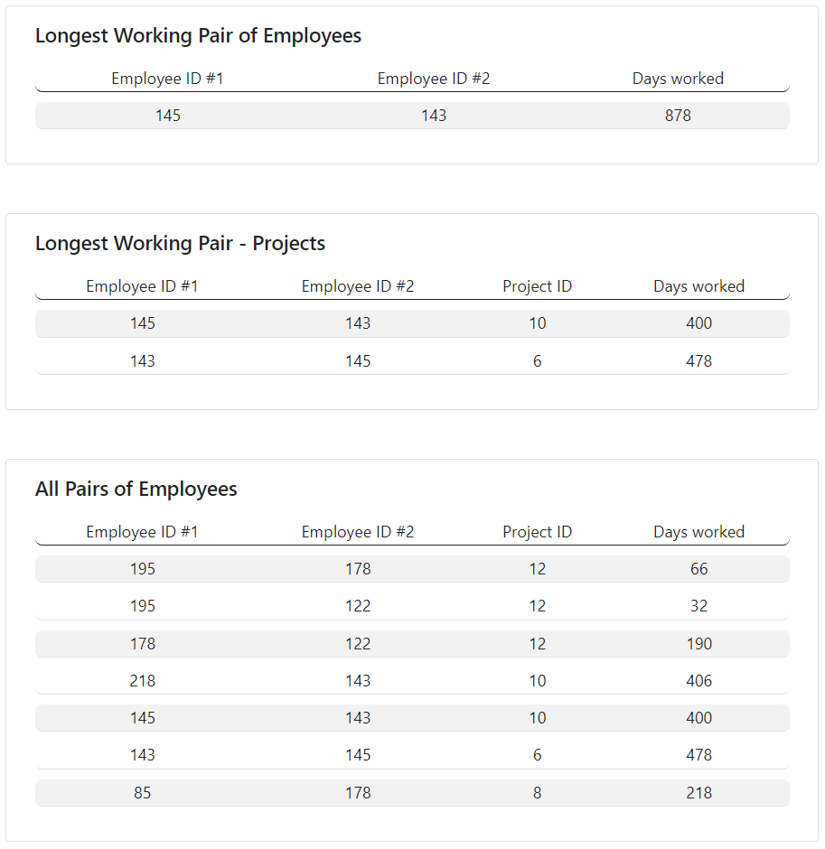

# Employees
This web app takes a CSV file with information about employees and projects and determines the pair of employees, who have worked together on common projects for the longest period of time.

# Technologies
- .NET Core 
- MVC Pattern with service layer
- HTML/CSS
- CsvHelper for file processing

## Features 
- Upload CSV file from file system
- The CSV must contain EmployeeId, ProjectId, StartDate, EndDate
- Input data validation
- Derive the longest working pair of employees, their projects and days worked together
- See all pairs of employees who have worked together

## Screenshots

